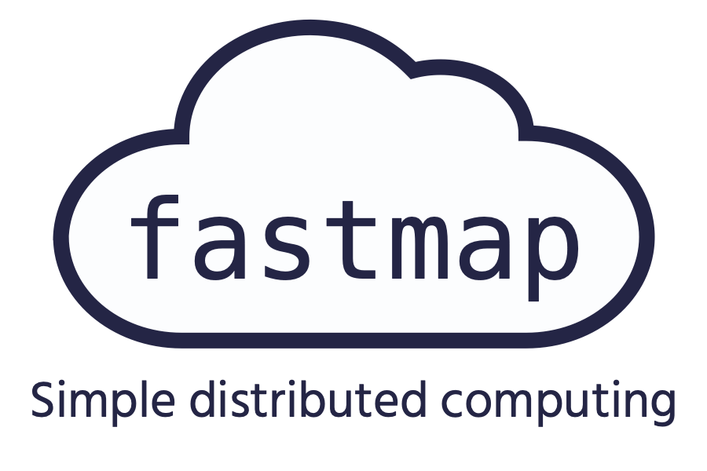

> Note: Fastmap is currently in beta. 


<p align="center">
    
</p>

Fastmap is a drop-in replacement for `map` that makes your Python code in parallel on the cloud. Fastmap is appropriate to use when `map` is too slow but setting up custom infrastructure would be overkill.


- **🚀 Speed up parallel tasks**. Fastmap automatically parallelizes your code and distributes work locally and on the cloud.
- **🐣 Trivial to use**. Add `global_init` to the top of your file, and replace every instance of `map` with `fastmap`. There is no code to upload and the SDK consists of [only 3 functions](https://fastmap.io/docs#interface).
- **🐣 Free and open**. Fastmap is open source, transparent, and simple. Don't get locked into proprietary frameworks or, for that matter, your own infrastructure.
- **🚀 Deploy in minutes**. With a Google Cloud Platform account, you can setup and deploy your fastmap cloud service with [one command](https://github.com/fastmap-io/fastmap-server).

### Docs

For complete documentation, go to [https://fastmap.io/docs](https://fastmap.io/docs),


### SDK installation

```bash
pip3 install -U fastmap
```


### Conceptual local example

This maps your code locally across multiple CPUs.
For a LOCAL exec policy, no extra server setup is required.

```python
import csv
from my_project import big_function
import fastmap

config = fastmap.init(exec_policy="LOCAL")

with open('lots_of_data.csv') as fh:
    long_list = list(csv.reader(fh))

results = list(config.fastmap(big_function, long_list))

```


### Conceptual cloud example

To setup a server to test with, see https://github.com/fastmap-io/fastmap-server. This can be deployed either locally or to GCP. After running the single-command deploy script, you will have your CLOUD_URL and SECRET_TOKEN.

*Important: Protect your secret token like a password and never commit it to version control*

```python
import csv
from config import CLOUD_URL, SECRET_TOKEN
from my_project import big_function
import fastmap

config = fastmap.init(
    cloud_url=CLOUD_URL,
    secret=SECRET_TOKEN)

with open('lots_of_data.csv') as fh:
    long_list = list(csv.reader(fh))

results = list(config.fastmap(big_function, long_list))

```


### Runnable example

See fastmap_example_test.py on the [open source cloud service repo](https://github.com/fastmap-io/fastmap-server). This will estimate pi using the Monte Carlo method.


### When should you use fastmap?

As a rule-of-thumb, fastmap will speed up any call to map that would have otherwise taken more than one second. This is possible because, under the default ADAPTIVE execution policy, fastmap algorithmically distributes work locally and across the cloud.

If you are planning to use the 'CLOUD' exec_policy, which prevents local processing, fastmap is appropriate when your function is either a scraper or is computationally-heavy. This is because transferring data to the cloud for processing always takes a non-zero amount of time. The trade-off depends on your network speeds and distance to your fastmap server cluster.

If in doubt, try running fastmap with a small test dataset. Fastmap attempts to be transparent and will inform you when using it has made your code slower.


### Questions

Fastmap.io is a new project and I would love to hear your feedback. You can contact me directly at scott@fastmap.io.
